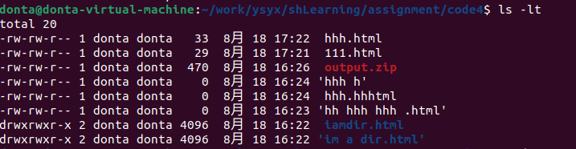

## 学习笔记
Bash中的字符串通过' 和 "分隔符来定义，但是它们的含义并不相同。以'定义的字符串为原义字符串，其中的变量不会被转义，而 "定义的字符串会将变量值进行替换。
```shell
foo=bar
echo "$foo"
# 打印 bar
echo '$foo'
# 打印 $foo
```


<figcaption>testPhoto</figcaption>


shell自带变量


bash也支持if, case, while 和 for 这些控制流关键字。同样地， bash 也支持函数，它可以接受参数并基于参数进行操作。下面这个函数是一个例子，它会创建一个文件夹并使用cd进入该文件夹。
```sh
mcd () {
    mkdir -p "$1"
    cd "$1"
}
```

注意，脚本并不一定只有用 bash 写才能在终端里调用。比如说，这是一段 Python 脚本，作用是将输入的参数倒序输出：
```sh
#!/usr/local/bin/python
import sys
for arg in reversed(sys.argv[1:]):
    print(arg)
```      

find命令会递归地搜索符合条件的文件，例如：
```sh
# 查找所有名称为src的文件夹
find . -name src -type d
# 查找所有文件夹路径中包含test的python文件
find . -path '*/test/*.py' -type f
# 查找前一天修改的所有文件
find . -mtime -1
# 查找所有大小在500k至10M的tar.gz文件
find . -size +500k -size -10M -name '*.tar.gz'

除了列出所寻找的文件之外，find 还能对所有查找到的文件进行操作。这能极大地简化一些单调的任务。

# 删除全部扩展名为.tmp 的文件
find . -name '*.tmp' -exec rm {} \;
# 查找全部的 PNG 文件并将其转换为 JPG
find . -name '*.png' -exec convert {} {}.jpg \;
```
尽管 find 用途广泛，它的语法却比较难以记忆。例如，为了查找满足模式 PATTERN 的文件，需要执行 find -name '*PATTERN*' (如果希望模式匹配时是不区分大小写，可以使用-iname选项）


## 作业

### code1 : 
#### 阅读 man ls ，然后使用 ls 命令进行如下操作：

    所有文件（包括隐藏文件）
    文件打印以人类可以理解的格式输出 (例如，使用 454M 而不是 454279954)
    文件以最近访问顺序排序
    以彩色文本显示输出结果

所有文件（包括隐藏文件）：
```sh
ls -a
```

文件打印以人类可以理解的格式输出：
```sh
ls -lh
```

文件以最近访问顺序排序：
```sh
ls -lt
```


以彩色文本显示输出结果：
```sh
ls --color=auto
```

将这些选项组合在一起，使用以下命令进行多个操作：

```sh
ls -alhtr --color=auto
```


### code2 : 
#### 编写两个 bash 函数 marco 和 polo 执行下面的操作。 每当你执行 marco 时，当前的工作目录应当以某种形式保存，当执行 polo 时，无论现在处在什么目录下，都应当 cd 回到当时执行 marco 的目录。 为了方便 debug，你可以把代码写在单独的文件 marco.sh 中，并通过 source marco.sh 命令，（重新）加载函数。

```sh
# 编写两个 bash 函数 marco 和 polo 执行下面的操作。 每当你执行 marco 时，当前的工作目录应当以某种形式保存，当执行 polo 时，无论现在处在什么目录下，都应当 cd 回到当时执行 marco 的目录。 为了方便 debug，你可以把代码写在单独的文件 marco.sh 中，并通过 source marco.sh 命令，（重新）加载函数。
#!/bin/bash

# 初始化 MARCO_DIR 数组
declare -a MARCO_DIR=()

# 定义 marco 函数
marco() {
    current_dir=$(pwd)
  # 获取当前目录路径

  # 将新地址插入到数组第0个位置
  MARCO_DIR=("$current_dir" "${MARCO_DIR[@]}")
  
   echo "Hello!!! This directory has been recorded in MARCO_DIR!"
}

# 定义 polo 函数
polo() {
  local index="$1"  # 声明本地变量 index 并将传入的参数赋值给它
  if [ -z "$index" ]; then  # 检查是否传入了参数
    index=0  # 如果没有传入参数，默认设置 index 为 0
  fi

  if [ $index -lt 0 ] || [ $index -ge ${#MARCO_DIR[@]} ]; then  # 检查传入的 index 是否有效
    echo "Error: Invalid index."
    return 1
  fi

  cd "${MARCO_DIR[$index]}" || { echo "Error: Failed to change directory."; return 1; }  # 切换到指定索引处的目录
}

# 定义 show_marco 函数，用于显示 MARCO_DIR 中存储的多个地址
show_marco() {
  if [ ${#MARCO_DIR[@]} -eq 0 ]; then  # 检查 MARCO_DIR 是否为空
    echo "MARCO_DIR is empty."
  else
    for i in "${!MARCO_DIR[@]}"; do  # 遍历 MARCO_DIR 数组
      echo "[$i] ${MARCO_DIR[$i]}"  # 显示索引和对应的目录路径
    done
  fi
}

# 定义 clr_marco 函数，用于清空 MARCO_DIR 数组
clr_marco() {
  MARCO_DIR=()
  echo "MARCO_DIR has been cleared."
}
```

#### 使用示例：


### code3


### code4：
#### 您的任务是编写一个命令，它可以递归地查找文件夹中所有的 HTML 文件，并将它们压缩成 zip 文件。注意，即使文件名中包含空格，您的命令也应该能够正确执行
```shell
find ./ -type f -name "*.html" -print0 | xargs -0 zip o| args -0 zip output.zip
```
#### 使用示例：


### code5
准备两个文件，分别是最近修改和最近使用


ls -lt 
找最近修改
可以看到hhh在111上面

```sh
find ./ -type f -exec stat -c "%X %n" {} + | sort -nr | head -n 10 | cut -d " " -f 2-
```

找最近使用
可以看到111在hhh上面

find ./ -type f：这个部分使用 find 命令递归地在当前目录（./）下查找所有的普通文件（排除目录和其他类型的文件）。

-exec stat -c "%X %n" {} +：这个选项告诉 find 命令在找到文件后，使用 stat 命令获取文件的修改时间。%X 表示最近访问time in int ,%n     file name


| sort -nr：这个管道符号将 find 命令的输出传递给 sort 命令进行排序。-n 选项表示将输入视为数值进行排序，-r 选项表示逆序（从大到小）排序。

| head -n 10：这个管道符号将 sort 命令的输出传递给 head 命令，从排序后的结果中选择前 10 行，即最近修改时间最大的 10 个文件。

| cut -d " " -f 2-：这个管道符号将 head 命令的输出传递给 cut 命令。-d " " 指定了分隔符为空格，-f 2- 表示输出从第二列到最后一列，即文件路径部分。

